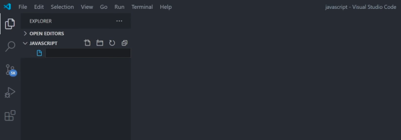
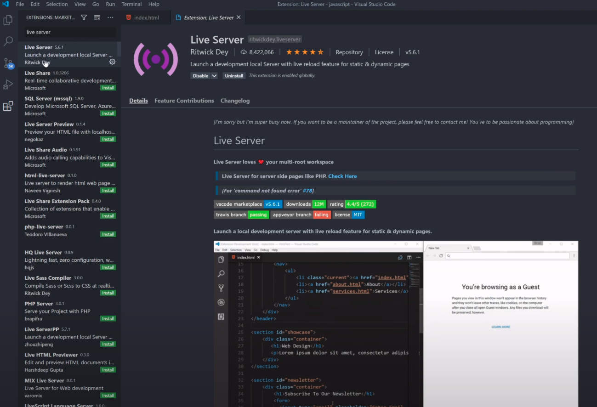
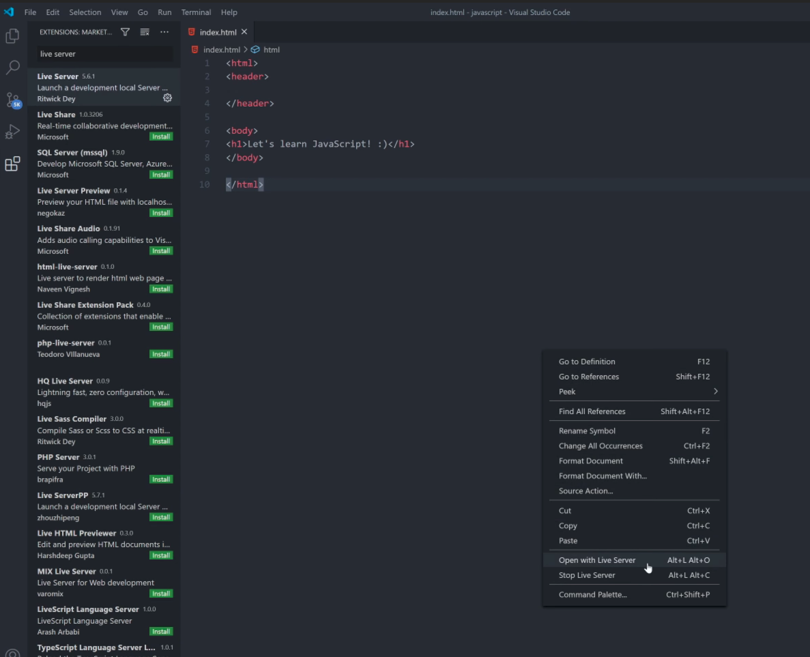
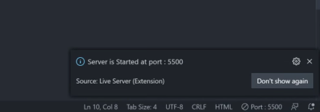
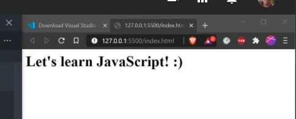
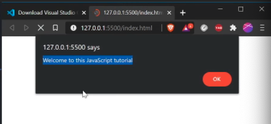
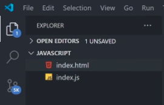

# Programmering 1

## Programvaror
(Bör vara installerade sedan tidigare)
[Visual Studio Code](https://code.visualstudio.com/)  
[Node.js](https://nodejs.org/en/)  
[live-server](https://www.npmjs.com/package/live-server)

## Kom igång
- Skapa en mapp på skrivbordet med namnet `JavaScript` detta kommer vara vår arbetsmapp under kursen.
- Starta VSCode och öppna din mapp 

Det bör se ut såhär efteråt: 


## Konfiguration
- Skapa index.html
- Installera live-server tillägget i VSCode (om det saknas)
- Starta live-server

### Skapa index.html
Kopiera koden nedan och lägg i index.html filen
```html
<html>
<header>
    
</header>

<body>
<h1>Let's learn JavaScript</h1>
</body>

</html>
```

### Installera live-server tillägget i VSCode (om det saknas)

- Klicka på plugins i menyn till vänster
- Sök efter 'live-server'
- Installera tillägget


### Starta live-server





## Ett första JavaScript 

- Skapa en fil index.js
- Skriv in följande kod:
    - ```javascript
      alert ("Welcome to this JavaScript tutorial")
      ```
- Lägg till följande i header-taggen i index.html:
    - ``` html
      <script src="./index.js"/>
      ```
- Index.html ska nu se ut enligt följande:
    - ``` html
      <html>
      <header>
      <script src="./index.js"/>
      </header>

      <body>
      <h1>Let's learn JavaScript</h1>
      </body>

      </html>
      ```
- Spara
- live-server kommer nu ladda om index.html i webbläsaren



## Mappstruktur

