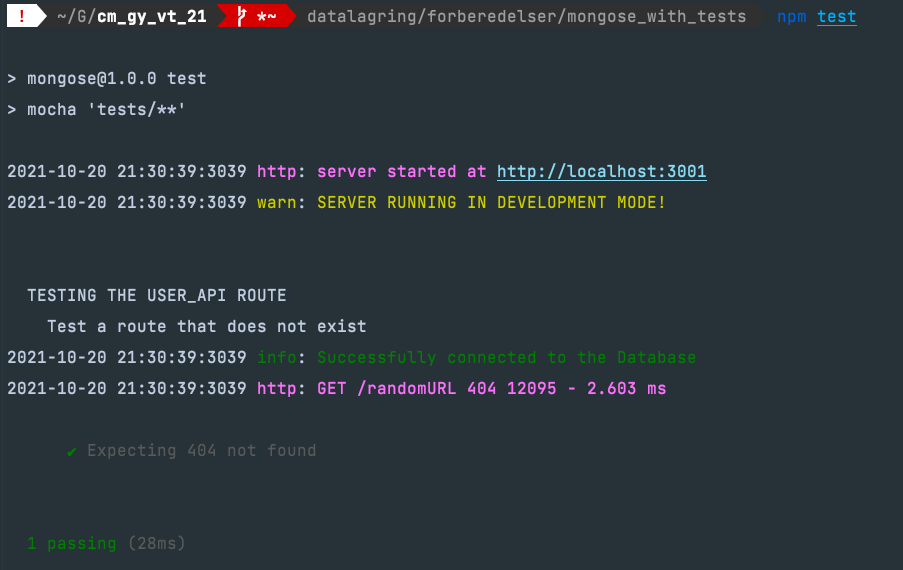
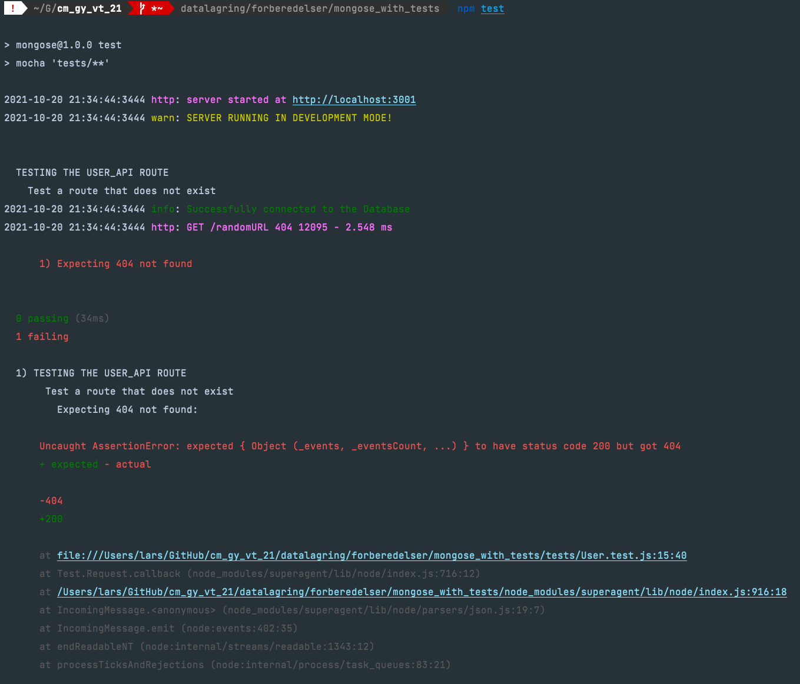

# Mongoose

## Innehållsförteckning

- [Installation](#installation)
    - [Basic setup `package.json`](#basic-setup-packagejson)
    - [Create`Server.js` file with content](#createserverjs-file-with-content)
    - [Create`.env` file with content](#createenv-file-with-content)
    - [Start server](#start-server)
    - [Nodemon](#nodemon)
    - [Replace console.log() with winston](#replace-consolelog-with-winston)
    - [Morgan middleware](#morgan-middleware)
    - [Own made middleware](#own-made-middleware)
- [Mongoose del](#mongoose-del)
    - [What is Mongoose ODM?](#what-is-mongoose-odm)
    - [What is the advantage of an ORM like Mongoose?](#what-is-the-advantage-of-an-orm-like-mongoose)
    - [Do we need ORM for MongoDB?](#do-we-need-orm-for-mongodb)
    - [Exempel](#exempel)
    - [HTTP Status Codes](#http-status-codes)
- [Unit tests with Mocha and Chai](#unit-tests-with-mocha-and-chai)
    - [](#)

## Installation

[Mongoose](https://mongoosejs.com/docs/)

```shell
npm init -y
npm i express dotenv helmet cors mongoose winston morgan
npm i -D nodemon
```

### Basic setup `package.json`

I `package.json` lägg till keywords så filen ser ut så här:

<details>

```json
{
  "name": "mongose",
  "version": "1.0.0",
  "description": "",
  "main": "src/Server.js",
  "type": "module",
  "scripts": {
    "start": "node .",
    "test": "echo \"Error: no test specified\" && exit 1"
  },
  "keywords": [
    "RestAPI",
    "Express",
    "cors",
    "mongodb",
    "mongoose"
  ],
  "author": "Lars Strömberg",
  "license": "ISC",
  "dependencies": {
    "cors": "^2.8.5",
    "dotenv": "^10.0.0",
    "express": "^4.17.1",
    "helmet": "^4.6.0",
    "mongoose": "^6.0.10",
    "morgan": "^1.10.0",
    "winston": "^3.3.3"
  },
  "devDependencies": {
    "nodemon": "^2.0.13"
  }
}
```

</details>

### Create`Server.js` file with content

Create a folder named `src`. In this folder, create a file named `Server.js`. Open the file and add the following
JavaScript.

<details>

```javascript
import express from 'express'
import dotenv from 'dotenv'
import cors from 'cors'
import { MongoClient } from 'mongodb'

dotenv.config()
const app = express();
const port = process.env.PORT
const mongodb_url = process.env.MONGODB_URL
const dbName = process.env.MONGODB_DB_NAME
const dbCollection = process.env.MONGODB_COLLECTION

app.use(cors({
    origin: '*',
    methods: ['GET', 'POST', 'PUT', 'DELETE']
}))

app.use(express.urlencoded({ extended: false }))
app.use(express.json())

// define a route handler for the default home page
app.get("/", (req, res) => {
    res.send("API is Alive!");
});

// start the Express server
app.listen(port, () => {
    console.log(`server started at http://localhost:${ port }`);
});
```

</details>

### Create`.env` file with content

In root folder, create a file named `.env`. Open the file and add the following:

<details>

```env
PORT=3001
MONGODB_URL=mongodb://localhost:27017/
MONGODB_DB_NAME=api
MONGODB_COLLECTION=users
NODE_ENV=development
```

</details>

### Start server

```shell
nodemon Server.js
npm start Server.js
npx start Server.js
```

### Nodemon

```shell
npx nodemon src/Server.js
```

### Replace `console.log()` with `winston`

[winston](https://www.npmjs.com/package/winston)

Create folder `utils` in `src`and create file `Logger.js` with content:

<details>

```javascript
import winston from 'winston'

const levels = {
    error: 0,
    warn: 1,
    info: 2,
    http: 3,
    debug: 4,
}

const level = () => {
    const env = process.env.NODE_ENV || 'development'
    const isDevelopment = env === 'development'
    return isDevelopment ? 'debug' : 'warn'
}

const colors = {
    error: 'red',
    warn: 'yellow',
    info: 'green',
    http: 'magenta',
    debug: 'white',
}

winston.addColors(colors)

const format = winston.format.combine(
    winston.format.timestamp({ format: 'YYYY-MM-DD HH:mm:ss:ms' }),
    winston.format.colorize({ all: true }),
    winston.format.printf(
        (info) => `${ info.timestamp } ${ info.level }: ${ info.message }`,
    ),
)

const transports = [
    new winston.transports.Console(),
    new winston.transports.File({
        filename: 'logs/error.log',
        level: 'error',
    }),
    new winston.transports.File({ filename: 'logs/all.log' }),
]

const Logger = winston.createLogger({
    level: level(),
    levels,
    format,
    transports,
})

export default Logger
```

In `Server.js` import:

```javascript
import Logger from "./utils/Logger.js";
```

</details>

### Morgan middleware

Create folder `config` in `src`and create file `MorganMiddleware.js` with content:

<details>

```javascript
import morgan from "morgan";

import Logger from "../utils/Logger.js";

// Override the stream method by telling
// Morgan to use our custom logger instead of the console.log.
const stream = {
// Use the http severity
    write: (message) => Logger.http(message),
};

// Skip all the Morgan http log if the
// application is not running in development mode.
// This method is not really needed here since
// we already told to the logger that it should print
// only warning and error messages in production.
const skip = () => {
    const env = process.env.NODE_ENV || "development";
    return env !== "development";
};

// Build the morgan middlewares
const morganMiddleware = morgan(
// Define message format string (this is the default one).
// The message format is made from tokens, and each token is
// defined inside the Morgan library.
// You can create your custom token to show what do you want from a request.
    ":method :url :status :res[content-length] - :response-time ms",
// Options: in this case, I overwrote the stream and the skip logic.
// See the methods above.
    { stream, skip }
);

export default morganMiddleware;
```

</details>

### Own made middleware

<details>

<summary>isAuthenticated()</summary>

```javascript
app.use(isAuthenticated)

function isAuthenticated(req, res, next) {
    Logger.info(req.query.admin)
    next()
}

app.get("/user", (req, res) => {
    res.send("API is Alive!");
});
```

Send query `http://localhost:3001/user?admin=true`

`Logger` will show `true` in console

```javascript
app.use(isAuthenticated)

function isAuthenticated(req, res, next) {
    req.query.admin === true
        ? res.next('You are Admin')
        : res.next("You can't make calls to this API URL")
    Logger.info(req.query.admin)
    next()
}

app.get("/user", (req, res) => {
    res.send("User API!");
});
```

`isAuthenticated(req, res, next)` will block all traffic without `?admin=true`

So we apply `isAuthenticated(req, res, next)` to only certain functions like this:

```javascript
// app.use(isAuthenticated)

function isAuthenticated(req, res, next) {
    req.query.admin === true
        ? res.next('You are Admin')
        : res.next("You can't make calls to this API URL")
    Logger.info(req.query.admin)
    next()
}

app.get("/user", isAuthenticated, (req, res) => {
    res.send("User API!");
});
```

</details>

<details>

<summary>notFound()</summary>

```javascript
function notFound(req, res, next) {
    const error = new Error('Not Found')
    res.status(404)
    next(error)
}

// After all valid url's
app.use(notFound)
```

</details>

<details>

<summary>errorHandler()</summary>

```javascript
function notFound(req, res, next) {
    const error = new Error('Not Found')
    res.status(404)
    next(error)
}

// After all valid url's
app.use(notFound)
```

</details>

## Mongoose del

[Mongoose](https://mongoosejs.com/) provides a straight-forward, schema-based solution to model your application data.
It includes built-in type casting, validation, query building, business logic hooks and more, out of the box.

### What is Mongoose ODM?

Mongoose is similar to an ORM (Object-Relational Mapper) you would use with a relational database. ... Mongoose is an
ODM that provides a straightforward and schema-based solution to model your application data on top of MongoDB's native
drivers.

### What is the advantage of an ORM like Mongoose?

The three main advantages of using Mongoose versus native MongoDB are: MongooseJS provides an abstraction layer on top
of MongoDB that eliminates the need to use named collections. Models in Mongoose perform the bulk of the work of
establishing up default values for document properties and validating data.

### Do we need ORM for MongoDB?

Why is using MongoDB better than using MySQL? ... Using MongoDB removes the complex object-relational mapping (ORM)
layer that translates objects in code to relational tables. MongoDB's flexible data model also means that your database
schema can evolve with business requirements.

### Exempel

- [Getting Started](https://mongoosejs.com/docs/index.html)
- [Connections](https://mongoosejs.com/docs/connections.html)

### HTTP Status Codes

- [List of HTTP status codes](https://en.wikipedia.org/wiki/List_of_HTTP_status_codes)
- [HTTP Status Codes](https://httpstatuses.com/)

## Unit tests with Mocha and Chai

### Installation

<details>

<summary>Installation</summary>

```shell
npm i --save-dev mocha chai chai-http
```

</details>

<details>

<summary>package.json</summary>

```json
{
  "name": "mongose",
  "version": "1.0.0",
  "description": "",
  "main": "src/Server.js",
  "type": "module",
  "scripts": {
    "start": "node .",
    "test": "echo \"Error: no test specified\" && exit 1"
  },
  "keywords": [
    "RestAPI",
    "Express",
    "cors",
    "mongodb",
    "mongoose"
  ],
  "author": "Lars Strömberg",
  "license": "ISC",
  "dependencies": {
    "cors": "^2.8.5",
    "dotenv": "^10.0.0",
    "express": "^4.17.1",
    "helmet": "^4.6.0",
    "mongoose": "^6.0.10",
    "morgan": "^1.10.0",
    "winston": "^3.3.3"
  },
  "devDependencies": {
    "chai": "^4.3.4",
    "chai-http": "^4.3.0",
    "mocha": "^9.1.3",
    "nodemon": "^2.0.13"
  }
}
```

</details>

### Setup

Create a new folder `tests` in the `root` directory.

In it create the file `User.test.js`

<details>

<summary>With content:</summary>

```javascript
import Chai from "chai"
import ChaiHTTP from "chai-http"
import { describe, it as test } from "mocha"
import app from "../src/Server.js"

Chai.should()       // Instantiate Chai
Chai.use(ChaiHTTP)  // Test against an API

const testingNonExistingRoute = () => {
  describe('Test a route that does not exist', () => {
    test('Expecting 404 not found', (done) => {
      Chai.request(app)
              .get('/randomURL')
              .end((request, response) => {
                response.should.have.a.status(404)
                done()
              })
    })
  })
}

describe('TESTING THE USER_API ROUTE', () => {
  testingNonExistingRoute()
})
```

</details>

Then we have to edit `package.json` and tell it how to use the tests.

<details>

<summary>Edit package.json</summary>

Edit the row:

```json
{
  "test": "echo \"Error: no test specified\" && exit 1"
}
```

To:

```json
{
  "test": "mocha 'tests/**'"
}
```

Which would run all the test-files in that folder.

</details>

Type in terminal:

```shell
npm test
```

### Result

#### Pass 



#### Fail


