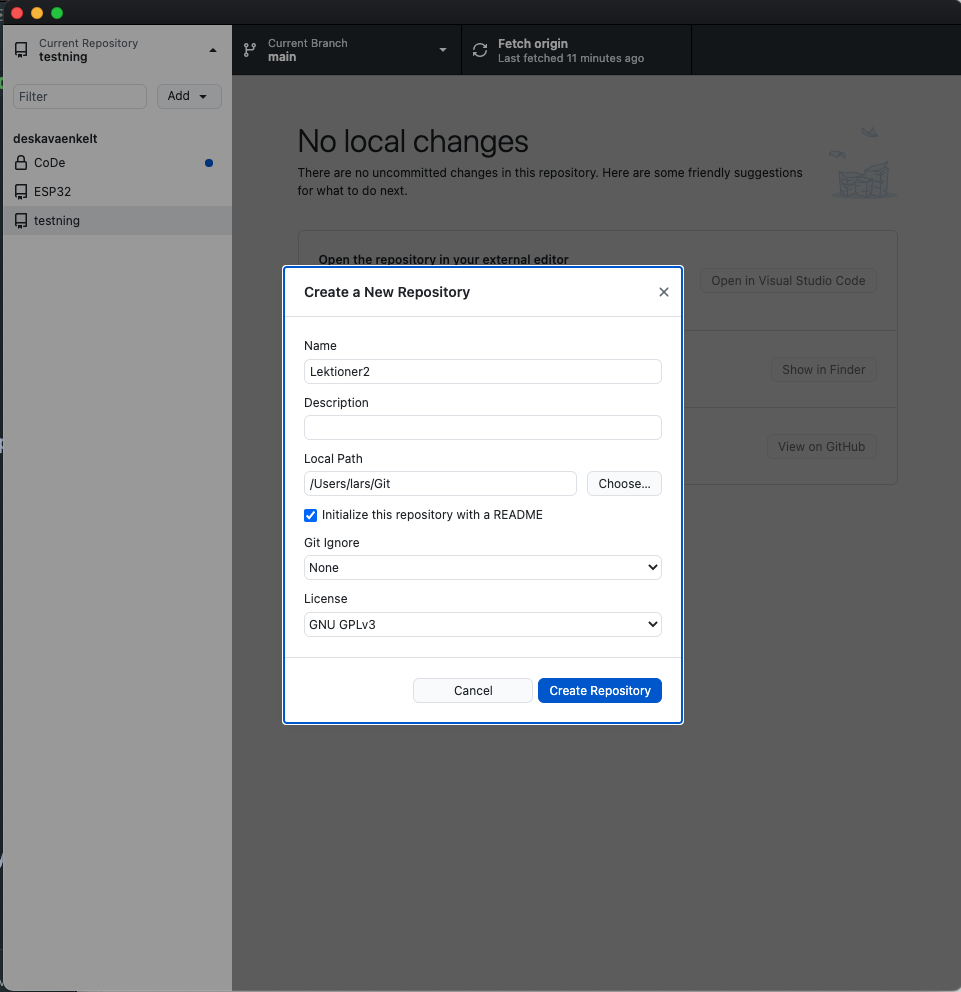
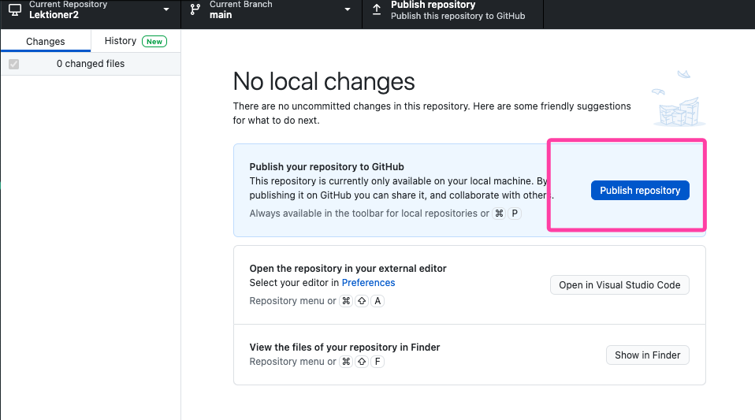
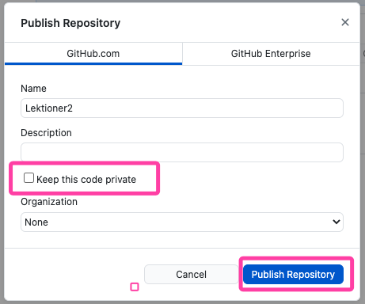

# Dagens lektion 2021-04-28

## Arbetsflöde

1. Började med att skapa en arbetsmapp Windows `C:\Git\Lektioner` eller MacOS `~Git\Lektioner`

2. Skapade React projekt med dagens datum som folder namn `npx create-react-app 2021-04-28`

3. Gick in i react projektet och startade det för att verifiera att det fungerar.

```shell
cd  2021-04-28
npm start
```

4. Rensade och tog bort filer som vi inte behöver samt tog bort referenser till de filerna i `Index.js` samt `App.js`.

5. Gör Lektioner mappen till ett git projekt.

    - Vi skapar ett repo på GitHub som heter "Lektioner" vi följer sedan instruktionerna där för att initiera och ladda
      upp repot.
    - Initialt så initierades repot i dagens datum foldern, så vi fick visa dolda filer och radera `.git`-mappen.
    - Sedan gjordes allt om igen men i rätt mapp.

```shell
echo "# Lektioner" >> README.md
git init
git add .

# ta bort filer som inte skulle komma med
git rm --cached .idea/.gitignore
git rm --cached .idea/Lektioner.iml
git rm --cached .idea/modules.xml
git rm --cached .idea/vcs.xml
echo ".idea/" >> .gitignore
git add .gitignore

git status
git commit -m "first commit"

git branch -M main
git remote add origin git@github.com:deskavaenkelt/Lektioner.git
git push -u origin main
```

6. Installera ett CSS ramverk i detta fallet [Tachyons](https://tachyons.io/)
    - Ctrl-c för att avsluta utvecklingsservern
    - `npm install tachyons@4.12.0`
    - `npm start`
    - importera Tachyons i `index.js`

7. Testa hur Tachyons fungerar lite lätt innan lunch.

8. Vi skapar en "Card-komponent" som vi ska kunna återanvända.
    - Den innehåller en bild, h1-tagg samt p-tag
    - Refactor våran kod (slimma ner den)

9. Skapar en CardList komponent som ska rendera alla robotar i robots.js.
    - Steg 1: Flytta innehåll från App till CardList
    - Steg 2: Loppa igenom alla robotar i robots.js och rendera dem till skärmen
    - Steg 3: Refactor
        - Tog innehållet från const cardArray och lade in det direkt i return funktionen.
        - Lade till en `key` för att ha index i domen på våra Card-komponenter
        - Vi kommenterade bort kod som inte används

10. Få till rätt font på vår h1-tagg (SEGA)

11. Lade in "linear-gradient()" på bakgrunden i body

12. Vi skapar en sökruta och stylar den men skapar inte funktionaliteten för den.

## Förbättringar

### Alternativt steg 1-5

1. Skapa git repo med GitHub Desktop och publicera







2. Skapade React projekt med dagens datum som folder namn `npx create-react-app 2021-04-28`

3. Gick in i react projektet och startade det för att verifiera att det fungerar.

```shell
cd  2021-04-28
npm start
```

4. Rensade och tog bort filer som vi inte behöver samt tog bort referenser till de filerna i `Index.js` samt `App.js`.

5. Commit och Push to origin

## Reflektion

Vi fick problem med versionshanteringen i git då `create-rect-app` också skapade ett git repo. Detta upptäcktes efter
att vi skulle koppla vårt projekt till GitHub.

Lösningen blev att radera `.git`-mappen i react projektet så att lektionsmappen kunde sköta versionshanteringen.

En lösning hade kunnat vara lösningen under förbättringar eller att skapa ett nytt React projekt och koppla det till ett
repo på GitHub.

# Getting Started with Create React App

This project was bootstrapped with [Create React App](https://github.com/facebook/create-react-app).

## Available Scripts

In the project directory, you can run:

### `npm start`

Runs the app in the development mode.\
Open [http://localhost:3000](http://localhost:3000) to view it in the browser.

The page will reload if you make edits.\
You will also see any lint errors in the console.

### `npm test`

Launches the test runner in the interactive watch mode.\
See the section about [running tests](https://facebook.github.io/create-react-app/docs/running-tests) for more
information.

### `npm run build`

Builds the app for production to the `build` folder.\
It correctly bundles React in production mode and optimizes the build for the best performance.

The build is minified and the filenames include the hashes.\
Your app is ready to be deployed!

See the section about [deployment](https://facebook.github.io/create-react-app/docs/deployment) for more information.

### `npm run eject`

**Note: this is a one-way operation. Once you `eject`, you can’t go back!**

If you aren’t satisfied with the build tool and configuration choices, you can `eject` at any time. This command will
remove the single build dependency from your project.

Instead, it will copy all the configuration files and the transitive dependencies (webpack, Babel, ESLint, etc) right
into your project so you have full control over them. All of the commands except `eject` will still work, but they will
point to the copied scripts so you can tweak them. At this point you’re on your own.

You don’t have to ever use `eject`. The curated feature set is suitable for small and middle deployments, and you
shouldn’t feel obligated to use this feature. However we understand that this tool wouldn’t be useful if you couldn’t
customize it when you are ready for it.

## Learn More

You can learn more in
the [Create React App documentation](https://facebook.github.io/create-react-app/docs/getting-started).

To learn React, check out the [React documentation](https://reactjs.org/).

### Code Splitting

This section has moved
here: [https://facebook.github.io/create-react-app/docs/code-splitting](https://facebook.github.io/create-react-app/docs/code-splitting)

### Analyzing the Bundle Size

This section has moved
here: [https://facebook.github.io/create-react-app/docs/analyzing-the-bundle-size](https://facebook.github.io/create-react-app/docs/analyzing-the-bundle-size)

### Making a Progressive Web App

This section has moved
here: [https://facebook.github.io/create-react-app/docs/making-a-progressive-web-app](https://facebook.github.io/create-react-app/docs/making-a-progressive-web-app)

### Advanced Configuration

This section has moved
here: [https://facebook.github.io/create-react-app/docs/advanced-configuration](https://facebook.github.io/create-react-app/docs/advanced-configuration)

### Deployment

This section has moved
here: [https://facebook.github.io/create-react-app/docs/deployment](https://facebook.github.io/create-react-app/docs/deployment)

### `npm run build` fails to minify

This section has moved
here: [https://facebook.github.io/create-react-app/docs/troubleshooting#npm-run-build-fails-to-minify](https://facebook.github.io/create-react-app/docs/troubleshooting#npm-run-build-fails-to-minify)
