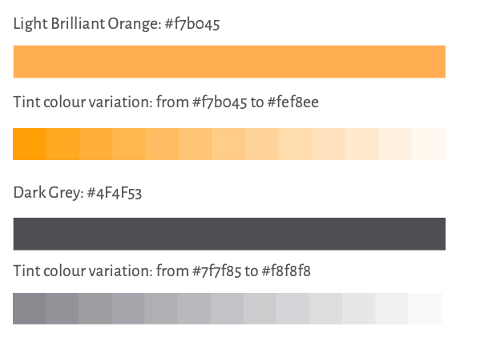
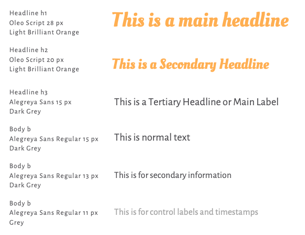

# Lektioner

# Lektion 2021-05-12

## Style guide

## Steg:

1. Skapa react projekt med dagens datum som namn 
2. `cd 2021-05-12`
3. `npm start`
4. Rensa bort onödigt
5. Skapa projektstruktur
6. Skaffa fonter från google fonts:
    - Alegreya Sans - Regular
    - Oleo Script - Regular
7. Skapa en global.css i foldern `utils/global/css/`
8. Implementera Font samt färger efter stil-guiden
9. Gör en navbar och följ färgschemat
10. Gör en footer och följ färgschemat
11. 
12. 
13. 
14. 
15. 
16. 
17. 

